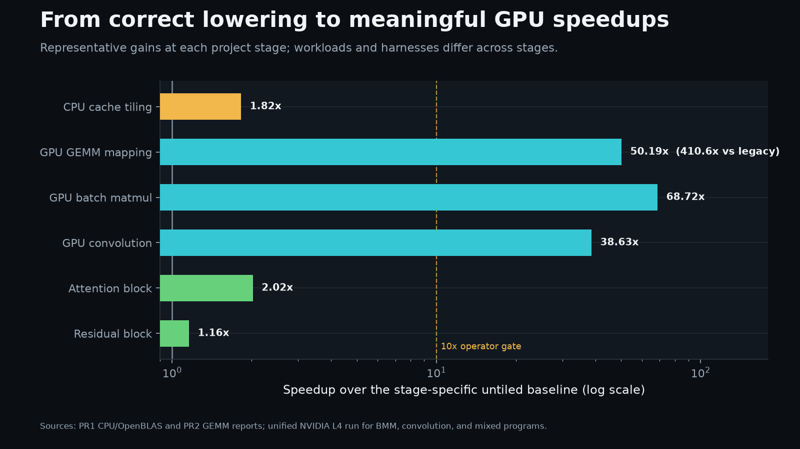
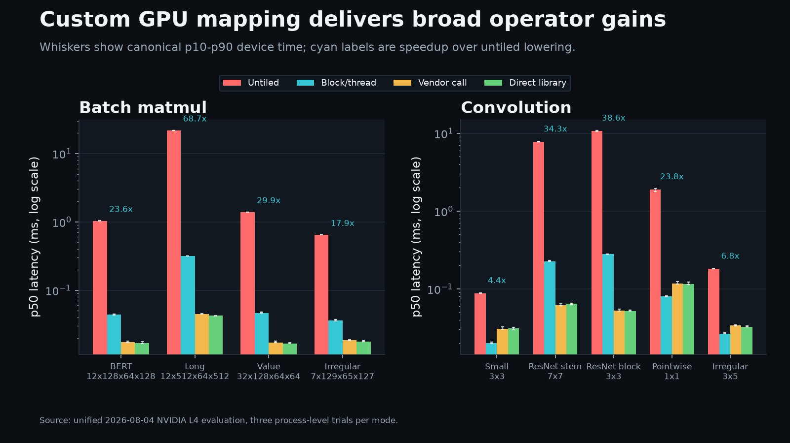
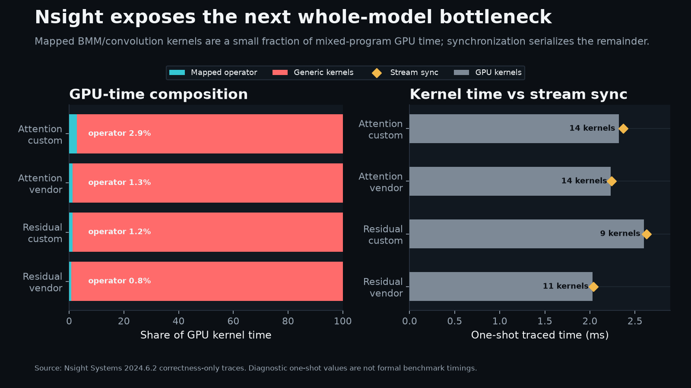

# PyTorch-to-MLIR CPU/GPU Compiler Exercise

## Abstract

This project extends the
[ML-compiler-exercise](https://github.com/DavidGinten/ML-compiler-exercise)
tutorial into an end-to-end PyTorch compilation and GPU optimization study.
PyTorch modules lower through torch-mlir and MLIR dialects to LLVM IR and
native executables targeting CPU/OpenBLAS or NVIDIA CUDA.

The extension adds post-bufferization GPU passes for matmul, batch matmul, and
NCHW/FCHW convolution; direct cuBLAS and cuDNN lowering paths; irregular-shape
correctness coverage; mixed attention and residual-block programs; and a
reproducible NVIDIA L4 evaluation workflow with CUDA-event timing, Compute
Sanitizer, tuning sweeps, and Nsight Systems traces.

## Performance Highlights

Explicit CUDA block/thread mapping turns the generic correctness baseline into
a practical custom kernel: long batch matmul improves by `68.72x`, and ResNet
3x3 convolution improves by `38.63x`. The earlier GEMM pass improved the
same-harness untiled path by `50.1x` and the 1,024-launch legacy path by
`410.6x`.

All regular and irregular operator shapes pass full-output validation. The
custom kernels close much of the gap to vendor libraries, although
compute-heavy shapes still need shared-memory tiling, vectorized access, and
eventually tensor-core lowering.

Nsight Systems shows why isolated gains only partly transfer to complete
programs: the mapped operators account for `2.88%` of attention GPU time and
`1.21%` of residual-block GPU time. Generic one-thread-block kernels and
per-kernel synchronization are now the primary whole-model bottlenecks.

See the [complete visual performance report](docs/performance_visuals.md) for
GEMM scaling, vendor efficiency, mixed-program results, tuning, methodology,
and reproducible figure-generation commands. The
[unified L4 evaluation](docs/l4_evaluation_results.md) contains the complete
timing and correctness record.

## Tutorial content

The repository provides small and real-world PyTorch models and demonstrates
the following:

1. Import models from PyTorch and HF to MLIR using [torch-mlir](https://github.com/llvm/torch-mlir)
2. Use existing MLIR passes to lower from entry-level IRs (`linalg`, `tensor`, `scf`, and `arith`) to LLVM IR
3. Create the corresponding object file
4. Call the model via a function call in C++

The original OpenBLAS lowering remains available alongside custom CUDA and
vendor-library GPU paths targeting the benchmarked NVIDIA L4 (`sm_89`).

*Warning*: Some instructions are RWTH cluster specific, e.g. paths.

1. [Introduction](https://github.com/DavidGinten/ML-compiler-exercise/blob/main/docs/Chapter1.md)
2. [Getting started and project setup](https://github.com/DavidGinten/ML-compiler-exercise/blob/main/docs/Chapter2.md)
3. [Importing PyTorch models to torch-mlir](https://github.com/DavidGinten/ML-compiler-exercise/blob/main/docs/Chapter3.md)
4. [Lowering models to x86 machine code](https://github.com/DavidGinten/ML-compiler-exercise/blob/main/docs/Chapter4.md)
5. [Integration of OpenBLAS for Matrix Multiplications](https://github.com/DavidGinten/ML-compiler-exercise/blob/main/docs/Chapter5.md)
6. [Targeting an Nvidia GPU](https://github.com/DavidGinten/ML-compiler-exercise/blob/main/docs/Chapter6.md)

*Appendix*: [An overview of IREE](https://github.com/DavidGinten/ML-compiler-exercise/blob/main/docs/iree_appendix.md)

## Build
See [Chapter 2](https://github.com/DavidGinten/ML-compiler-exercise/blob/main/docs/Chapter2.md) in the docs.

## References
- [Official MLIR website](https://mlir.llvm.org/)
- [MLIR for Beginners](https://www.jeremykun.com/2023/08/10/mlir-getting-started/) by Jeremy Kun
- [MLIR tutorial with GPU compilation](https://www.stephendiehl.com/tags/mlir/) by Stephen Diehl
