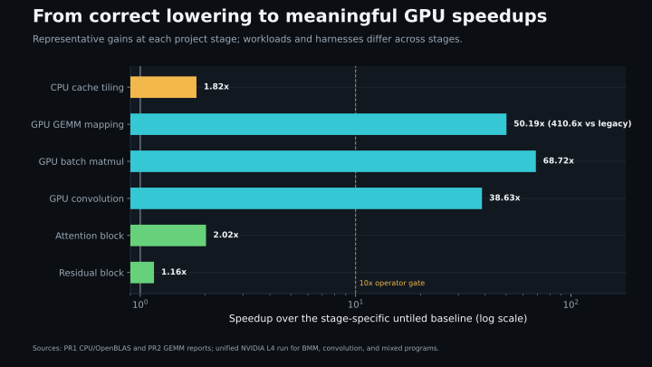
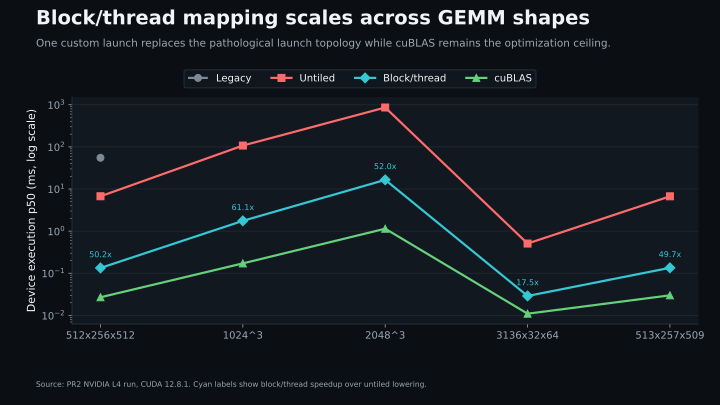
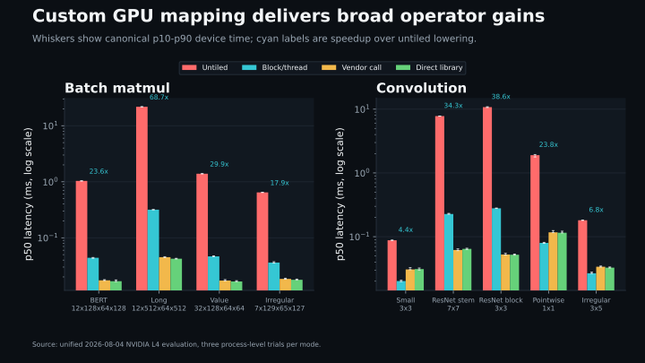
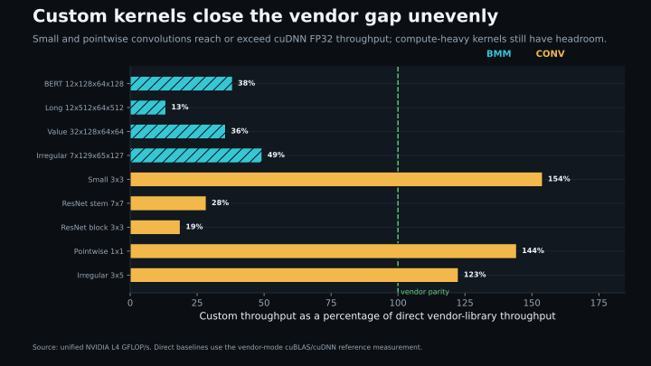
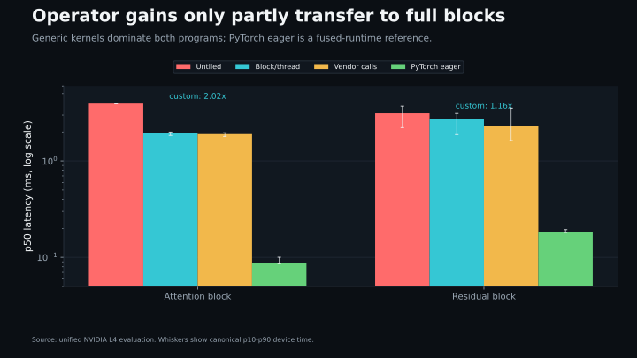
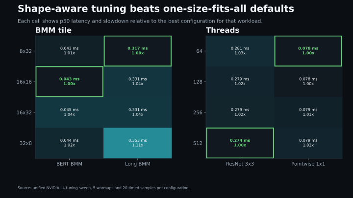
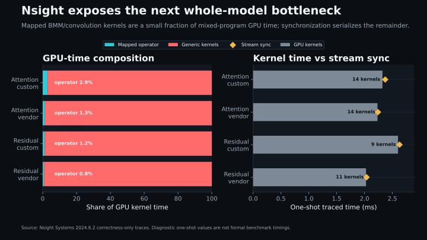

# Performance Visuals

This report summarizes the performance story of the MLIR compiler extensions:
CPU cache tiling, CUDA block/thread mapping for matmul and batch matmul, GPU
convolution lowering, vendor-library dispatch, mixed PyTorch-derived programs,
and Nsight Systems analysis.

The early CPU and GEMM figures are historical PR1/PR2 measurements. BMM,
convolution, mixed-program, tuning, and Nsight figures use the unified
2026-08-04 NVIDIA L4 evaluation. Values from different runs are labeled and
are not treated as directly comparable samples.

## Optimization Progression



The project moved through three distinct performance problems:

1. CPU cache tiling improved a MobileNet-shaped GEMM by `1.82x`.
2. Explicit CUDA grid/block mapping removed pathological launch topology and
   produced `38.63x-68.72x` representative operator speedups.
3. Mixed programs improved by only `1.16x-2.02x`, showing that optimizing one
   operator family is not enough to optimize a complete graph.

The PR2 GEMM bar uses the same-harness untiled baseline. The annotation also
reports the `410.6x` gain over the older 1,024-launch legacy lowering.

## GEMM Scaling



The custom block/thread kernel is consistently `17.5x-61.1x` faster than
untiled generic lowering across regular, model-derived, and irregular shapes.
It reduces the `512x256x512` implementation from 1,024 launches to one launch.
cuBLAS remains substantially faster because the custom pass does not yet use
shared-memory K tiling, vectorized loads, or tensor cores.

## BMM And Convolution



Explicit GPU mapping generalizes beyond plain GEMM:

- BMM improves by `17.9x-68.7x` across four attention-derived shapes.
- Convolution improves by `4.4x-38.6x` across five kernel configurations.
- Every custom and vendor result passed full-output comparison, including
  irregular boundaries.
- Whiskers show canonical p10-p90 CUDA-event time from three process-level
  trials, collected independently of diagnostics and profiling.

## Distance From Vendor Libraries



The remaining vendor gap is shape-dependent. Compute-heavy long BMM and
ResNet convolutions reach only `13%-28%` of direct cuBLAS/cuDNN throughput.
Small, pointwise, and irregular convolutions exceed the selected pedantic-FP32
cuDNN algorithms in this harness. This does not make the custom implementation
universally faster than cuDNN; it shows that dispatch and algorithm overhead
matter on smaller workloads while data reuse dominates larger ones.

## Mixed PyTorch-Derived Programs



Replacing two BMMs halves attention latency, but replacing two convolutions
improves the residual block by only `1.16x`. The vendor paths are close to the
custom mixed-program paths despite much faster isolated operators. PyTorch
eager CUDA remains considerably faster because it is a mature fused runtime
reference rather than an equivalent MLIR lowering pipeline.

## Parameter Tuning



No configuration wins every shape:

- BERT BMM favors `16x16`; long BMM favors `8x32`.
- ResNet 3x3 favors 512 threads; pointwise convolution favors 64 threads.
- The default `8x32` BMM tile and 256-thread convolution mapping stay within a
  few percent of the best measured setting across these workloads.

This motivates shape-aware selection rather than a single hard-coded launch
configuration, while confirming that the current defaults are reasonable.

## Nsight Systems Bottlenecks



Nsight Systems explains why isolated gains do not transfer to the full blocks:

- The two mapped BMM kernels consume only `2.88%` of custom attention GPU
  kernel time.
- The two mapped convolution kernels consume only `1.21%` of custom residual
  GPU kernel time.
- Most remaining GPU time belongs to generic elementwise, transpose,
  reduction, and normalization kernels launched with one-thread blocks.
- Stream synchronization time closely tracks total GPU kernel time, exposing
  serialized execution and little CPU/GPU overlap.

These traces are one-shot diagnostics and include profiler/runtime effects.
The formal performance claims use the preallocated CUDA-event measurements,
not the Nsight wall-clock timeline.

## Key Insights

1. **Mapping matters.** Correct GPU lowering is not enough; explicit block and
   thread topology changes performance by one to two orders of magnitude.
2. **Data reuse is next.** Shared-memory K tiling and vectorized access are the
   clearest path toward cuBLAS/cuDNN on compute-heavy operators.
3. **Whole graphs need fusion.** Generic kernels and synchronization now matter
   more than the mapped operator in both mixed programs.
4. **Shape-aware policies matter.** Tile and thread choices should eventually
   depend on operation shape and hardware properties.
5. **Correctness stayed first-class.** Full-output comparison, irregular-shape
   tests, launch checks, and Compute Sanitizer all passed before timing.

## Methodology And Reproduction

The unified run used one NVIDIA L4, CUDA 12.8.1, `sm_89`/PTX 8.0, 10 warmups,
50 timed samples, and three process-level trials. Canonical values are medians
of trial p10, p50, and p90 values. Formal timing excludes allocation, output
reset, diagnostics, sanitizers, and profilers.

Generate and validate every figure from the repository root:

```bash
python3 -m venv /tmp/mlir-viz-venv
/tmp/mlir-viz-venv/bin/pip install -r requirements-visualization.txt
/tmp/mlir-viz-venv/bin/python src/benchmarks/plot_project_performance.py
/tmp/mlir-viz-venv/bin/python -m unittest tests/plot_project_performance.py
```

The generator reads:

- `docs/data/historical_benchmarks.csv` for PR1/PR2 measurements.
- `runpod_results/l4_eval_2026-08-04/summary.csv` for canonical unified timing
  and tuning data.
- `runpod_results/l4_eval_2026-08-04/nsys/` for CUDA API and kernel summaries.

Generated files are deterministic SVG and 1600x900 PNG pairs. The plotting
test validates source invariants, dimensions, XML parsing, file completeness,
and byte-identical regeneration.
